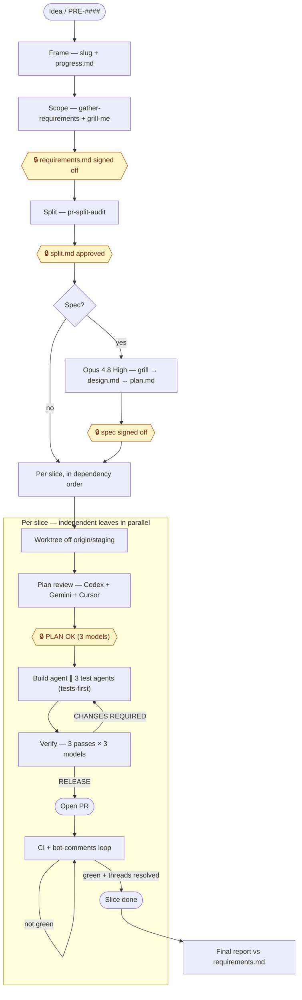

# sf — software factory

The `start-feature` pipeline as a namespaced set of `sf:` commands, so you can run the whole factory or enter at any phase and resume from saved state.

## How `start-feature` works

Idea → open PR through left-shifted, gated phases. Hexagons are **human gates** (hard stops); the per-slice build↔verify loop and the CI loop are the two cycles. State is markdown in `.scratch/<slug>/`; gates are real tool calls (Codex verdict, lint, jest), not self-assessment.



Worker provider (build + test agents) follows `/sf:model-provider`; the review panel stays cross-vendor. The deterministic version of the per-slice loop is `sf:build-verify`.

All commands share one state contract: `.scratch/<slug>/` holding `progress.md` (phase checklist + gate outcomes), `requirements.md` (the locked acceptance contract), and `split.md` (the slice plan). Commands that don't take a slug locate the feature by: slug arg → current git branch → most-recently-modified `.scratch/*/progress.md` → ask.

| Command | Does |
|---|---|
| `sf:install` | Check (and help fix) the external deps the cross-vendor review needs: Cursor CLI, Codex CLI (the `codex` MCP is optional — `codex-agent` uses the CLI directly), then prompt for the `branchPrefix` config. Run this once per machine before the rest. |
| `sf:reload [plugin\|plugin@marketplace]` | Sync the installed plugin cache from its local marketplace source (default: `sf` itself) via `claude plugin update`, then tell you to restart to pick it up. Run after editing a command in `commands/`. |
| `sf:start-feature <idea\|PRE-####>` | Full pipeline, idea → open PR. Delegates to the `start-feature` skill. |
| `sf:investigate <report>` | Start from a reported bug instead of a feature idea: grill, root-cause, problems + requirements, decide on a spec, then run the factory from Phase 2 onward. |
| `sf:continue [slug]` | Read `progress.md`, resume from the first pending phase. |
| `sf:plan [idea\|PRE-####]` | Phases 0–2 only: frame, scope + lock `requirements.md`, split. Stops at split approval. |
| `sf:build [slug\|slice]` | Worktree + 3-model plan review + build + tests for a slice, as prose (model-driven). Commits locally, no push. |
| `sf:build-verify [slug]` | Same Phase 3 machine as a **deterministic Workflow**: schema'd `PLAN OK`/`RELEASE` verdicts, cross-vendor (Codex+Gemini+Cursor) `parallel()` thunks, capped build↔verify loop over a wave of independent slices, to pre-PR RELEASE. Halts back to you for width questions. Never pushes. |
| `sf:review [branch\|PR\|slug]` | `review-feature`: gate pre-PR (3 models), open PR on RELEASE, loop CI + bots to green. |
| `sf:ci-green [PR]` | Just the CI/bot loop: `fix-bot-comments` until all checks green + threads resolved, asking before any fix that adds more complexity than the feature warrants. |
| `sf:fix-pr [PR]` | Same green-gate as `sf:ci-green`, but reviews the diff with Codex + Cursor *before* each push so fewer bot round-trips are needed. |
| `sf:view-agents` | Open the local agent-team dashboard (starts its dev server on :7777 first if needed). |

The phase commands delegate to skills bundled with this plugin under `skills/` — `gather-requirements`, `pr-split-audit`, `solve-in-worktrees`, `review-feature`, `pre-pr-gate`, `fix-bot-comments`, `discussion-room`, `create-branch`, `create-pr`, `cursor-agent`, `diff-review`, `commit-hang-guard`, `lint-in-ignored-worktree`, `linear-update-issue-on-pr-merge`, `prune-merged-worktrees`, `setup-worktree-webapp`, `start-feature` itself — plus the `tech-lead` subagent under `agents/`. One implementation each, no forks. `grill-me` is the one exception: it's not bundled here because it already ships in the separate `anthropic-skills` plugin, which most installs already have.

### Portability

Everything sf's commands and skills call is bundled inside this plugin (`skills/`, `agents/`, `workflows/`) and referenced via `${CLAUDE_PLUGIN_ROOT}` (or `args.pluginRoot` inside `build-verify-slice.js`, which has no filesystem access of its own) — never a hardcoded `~/.claude/skills/...` path. Installing `sf@sf` on another machine gets you the whole pipeline, no separate skill installs required.

No absolute host paths remain in any skill either. Where a skill needs the repo or a worktree, it derives the path at runtime instead of hardcoding a checkout location:
```bash
# main worktree (env-file source), and where sibling worktrees live — works wherever the repo is cloned
MAIN=$(git worktree list --porcelain | sed -n 's/^worktree //p' | head -1)
TREES_ROOT=$(dirname "$MAIN")
```
`git worktree list` always prints the main worktree first, so this resolves the same whether it's run from the main checkout or a linked worktree. Home-relative paths (the split-plan dir) use `~/.claude/plans/`, and the "don't run `tsc --noEmit`" rule now points at "the repo's `CLAUDE.md`" rather than one absolute file.

The branch author prefix is a first-class install-time setting, not a hardcoded string. The plugin declares a `branchPrefix` `userConfig` option (see `.claude-plugin/plugin.json`); Claude Code prompts for it when the plugin is first enabled and substitutes it into `create-branch` / `solve-in-worktrees` via the `${user_config.branchPrefix}` token. Leave it blank and the skills fall back to your shell username (`whoami`), so a colleague gets `alice/feat-…` with zero edits. Change it later with `/plugin configure sf`.

The one remaining *convention* (not a path, doesn't block install): worktrees are assumed to be siblings of the main checkout.

## `sf:build` (prose) vs `sf:build-verify` (Workflow)

`start-feature` line 18 flags its own soft spot: the phase ordering and the 3-model vote are prose the model executes by hand, so it *can* skip ahead. `sf:build-verify` is the "promote the orchestrator to a script" answer to that — the Phase 3 machine (plan-review → build + 3 test agents → 3-pass × 3-model verify → capped build↔verify loop) as `workflows/build-verify-slice.js`, where the verdicts are schema-validated objects, the 2-of-3 reconciliation is real code, the loop cap is a real loop, and an interrupted run resumes via `resumeFromRunId` instead of re-running every verify.

What stays out of the script, on purpose (a Workflow is headless and can't call `AskUserQuestion`): the width-question gate (the script returns the questions and halts the slice), the plan-ambiguity gate, and push + PR + CI. Those are the human seams `start-feature` is built around; `sf:build-verify` runs the deterministic stretch *between* them. Cross-vendor diversity is preserved — each reviewer is the real Codex/Gemini/Cursor invoked from inside a thin Claude driver agent, not three Claude agents.

Use `sf:build` when you want to watch and steer a single slice; use `sf:build-verify` for a wave of independent slices you want run to RELEASE hands-off and resumable.

Editing the workflow: the script lives at `workflows/build-verify-slice.js`. Reinstall (or restart) after editing so the installed copy under `plugins/cache/` picks it up, same as the `.md` commands.

## Stay-hot mode (`--stay-hot`)

Opt-in on `sf:build` and `sf:review` to keep your own coding skill from rusting while the factory does the typing. Off by default; only fires when you pass the flag.

- On `sf:build`, at plan-release each task is scored **1–5** (whole number, 5 = "absolutely yes a human should write this") on **blast-radius + inverted build-agent confidence**. The single highest task, only if it hits **5**, is handed to you: the worktree **pauses and blocks** until you've written it, then the agents build the rest and its tests. At most one hand-off per run.
- On `sf:review`, the same score is applied to required fixes; the single highest fix, only if a **5**, is yours to write, blocking the loop until done.

Frequency is the threshold, not a percentage — only a 5 fires, so hand-offs stay rare across features. Every decision is logged (date, slug, phase, score, summary) to `~/.claude/sf-stay-hot.log`. There's no tuner yet: eyeball the log and adjust by hand if 5s fire too often or too rarely.

Not yet honoured by `sf:build-verify` (the deterministic Workflow) — that path needs a new halt reason in `workflows/build-verify-slice.js`, so for now use `sf:build` when you want stay-hot on the build phase.

## Install

One line, from GitHub:

```bash
claude plugin marketplace add Dwonczykj/sf && claude plugin install sf@sf
```

Inside Claude Code: `/plugin marketplace add Dwonczykj/sf` then `/plugin install sf@sf`. Then run `/sf:install` once per machine.

This plugin is published to [`Dwonczykj/sf`](https://github.com/Dwonczykj/sf) from `local-plugins/sf/` in the config repo via `git subtree`. Edit here, then publish with `git subtree push --prefix=local-plugins/sf sf-dist main` (remote `sf-dist` → `Dwonczykj/sf`). For local dev against this working tree, point a marketplace at `~/.claude/local-plugins/sf`.

## Edit

Edit the `.md` files in `commands/` directly, then reinstall (or restart) to pick up changes.

### Auto version bump (dev hook)

The plugin cache is keyed by `plugin.json`'s `version`, so a change shipped without a bump silently never reloads. `.githooks/pre-commit` fixes this: when a commit stages plugin files but doesn't already change the version, it bumps the patch and stages `plugin.json`. It never blocks a commit — any problem just skips the bump. Install it once per clone (git can't auto-enable checked-in hooks):

```bash
# standalone Dwonczykj/sf clone (plugin at repo root):
git config core.hooksPath .githooks

# inside the config repo (plugin at local-plugins/sf) — symlink so other hooks are untouched:
ln -sf ../../local-plugins/sf/.githooks/pre-commit .git/hooks/pre-commit
```

Bump the minor/major by hand when a change warrants it; the hook only defaults the patch when you forget.
